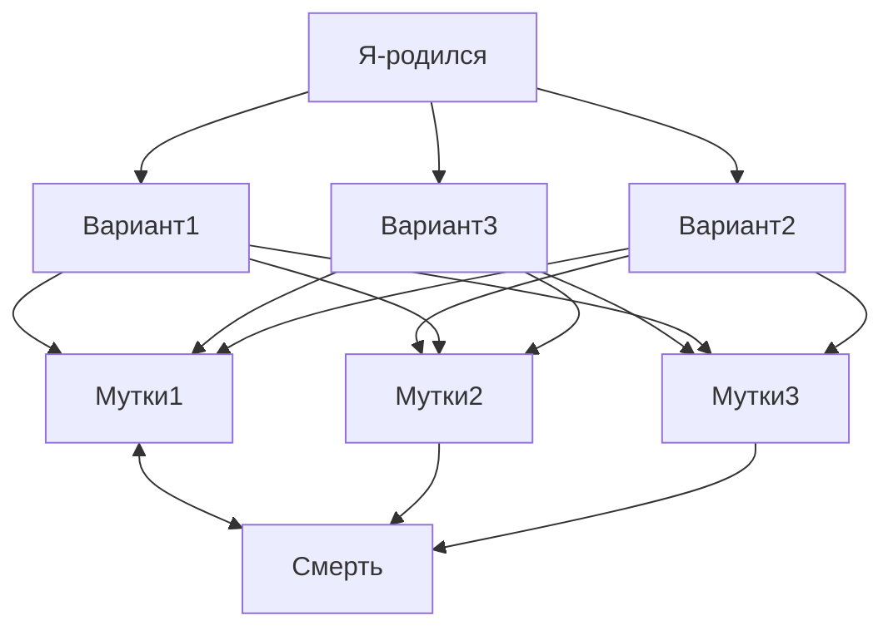
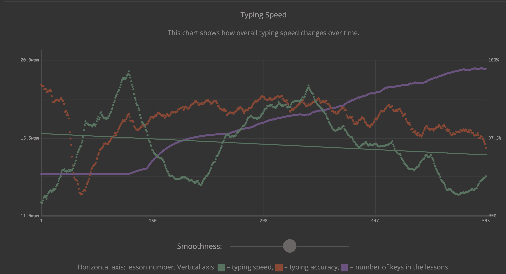
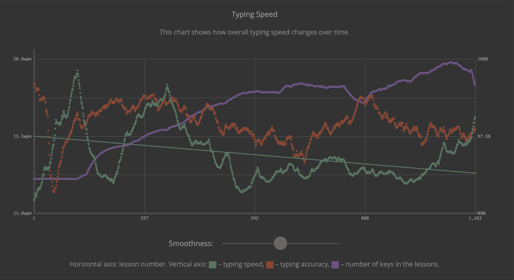

# Обо мне

  Родиля в Омске в 1971 году. Учился в школе №14. Закончил в 1993 году 
  Омский Политехнический Институт ОмПИ теперь он называется
  Омский Технический Университет ОмТУ. Факультет автоматизации 
  Специальность 2201 ЭВМ сисиемы комплексы и сети. ... Сейчас живу в Сочи

  <details>
  <summary> Тут живу </summary>

  ```geojson
{
  "type": "FeatureCollection",
  "features": [
    {
      "type": "Feature",
      "id": 1,
      "properties": {
        "ID": 0
      },
      "geometry": {
        "type": "Polygon",
        "coordinates": [
          [
              [39.5,43.6],
              [39.5,43.4],
              [40,43.4],
              [40,43.6],
              [39.5,43.6]
          ]
        ]
      }
    }
  ]
}
```
  
  </details> 
  
# Вот список моих интересов: 

## NeoVim

Начал изучение с азов и установки версии 0.14. Конечно через brew install neovim

Игра для изучения vim (https://vim-adventures.com/) прошел три урока и далее платно. Буду документацию читать.

[NeoVim #2. Мнемоники и прокачка внешнего вида.](https://www.youtube.com/watch?v=S4SL9-k1qOw&list=PLzWf2xLEjn8bnlh2yJ3W0eYbvcwkwA5F2&index=2)

### Режим движения h j k l
### Прыжки по словам w e b W B
### i, Esc, a, I, A
### y, u, x
### o, O

## GitHub

Тут я изучаю [MarkDown](https://docs.github.com/en/get-started/writing-on-github/getting-started-with-writing-and-formatting-on-github/basic-writing-and-formatting-syntax)

  <details>
  <summary> Mermaid диаграмы </summary>
Интересно что можно рисовать схемы:


  </details>    


## Слепая печать на клавиатуре

  * Хороший клавиатурный тренажер [Keybr](https://www.keybr.com/) на нем я сейчас тренируюсь

  * Хорошая соревновалка, но я до нее не дорос [MonkeyType](https://monkeytype.com/)

  <details>
  <summary> Мой прогрес в клавиатурном тренажёре Keybr </summary>
  
  [Keybr](https://www.keybr.com/)
  
  | Месяц | Скорость wpm English | Скорость wpm Русский |
  | :---: |--------------|--------------|
  |  Март | 13wpm 15 Letters||
  | Апрель 1| 12wpm 17 Letters EH:03||
  | Апрель 2| 13wpm 17 Letters EH:03|
  | Апрель 9| 13wpm 16 Lettres 98 Accuracy| 10wpm 9 Букв 96 Accuracy|
  | Апрель 17| 14wpm 23 Lettres 96 Accuracy| 13wpm 11 Букв 96 Accuracy|

  
  

  
  </details>    

  Тут буду дополнять ресурсы и прогресс если он будет ...

## Клавиатуры

  * [Keychron](https://keychron-russia.com/) Промышленный производитель выросший из краудфандинга
  * [ErgoHaven](https://eh.works/) Классная контора в Краснодаре - делает сплит клавиатуры
  * [Фигурные клавиши на Авито](https://www.avito.ru/moskva/tovary_dlya_kompyutera/keykapy_klp_lame_i_reptiloid_dlya_klaviatury_7974187203?utm_campaign=native&utm_medium=item_page_ios&utm_source=soc_sharing)
  * [Keycup profiles](https://en.akkogear.com/blog-ultimate-guide-to-keycap-profiles/)
  * [geekboards lofree](https://geekboards.ru/product/nabor-klavish-lofree-ks-theme)
  * [AKKO profile](https://en.akkogear.com/product/carolina-blue-keycap-set/?srsltid=AfmBOooDUEfmMNS7eCJzftUGLdzzLD1ztt1HpybQgn5BKjZ6v7XZuQor)
  * [Репозиторий для печати](https://github.com/vvhg1/clp-keycaps?tab=readme-ov-file)
  * [Заказ с форума образец](https://t.me/c/1464748383/1/125392)
  * Сейчас у меня такая клава [CIDOO Alice](https://github.com/kev1971/CIDOO-ABM066/)
  * [EH K:03](https://eh.works/k03)
  * Outemu Silent Tom - на К:03
  * [CIDOO Silent Blue Switch - Cidoo ABM066 silent blue switch (Белая)](https://www.ozon.ru/product/mehanicheskaya-besprovodnaya-klaviatura-cidoo-abm066-silent-blue-switch-belaya-dlya-kompyutera-2606064097/) 
  * [keychron q10 Gateron Jupiter Red
Gateron Jupiter Brown
Gateron Jupiter Banana AKKO lavander purple](https://www.avito.ru/moskva/tovary_dlya_kompyutera/klaviatura_keychron_q10_7951757535) (https://keychron-russia.com/q10max)
  * (HRM программа)[https://github.com/wontaeyang/hrm]
    
## Языки программирования

  ### Java

  Видеоуроки:
  
  [Java с нуля / Ablazing](https://www.youtube.com/playlist?list=PLw265NhvhLXHptSyZ93dFd_7AoPnJTF1T)
  
  [Программирование на Java (весна 2022) Computer Science Center / Тахир Валеев](https://www.youtube.com/playlist?list=PLlb7e2G7aSpTCB2OxGlezpgOXwq4xer7Z)

  ### Swift

  [swift-book](https://docs.swift.org/swift-book/documentation/the-swift-programming-language/)

  [Youtube Свифт Марафон / Скутеренко](https://www.youtube.com/watch?v=YgEHfnD6_1c&list=PL6724Ll8v6UhOq6Otjw-rUPFsZVmoCLFm&index=3)

  [Основы Swift](https://youtube.com/playlist?list=PLUb9K99oQb2u1swlk6TTuV1vnMEG8ktfV&si=rUU5zRR_HHfa68sV)
  
  ### Python

<picture>
  <source media="(prefers-color-scheme: dark)" srcset="https://user-images.githubusercontent.com/25423296/163456776-7f95b81a-f1ed-45f7-b7ab-8fa810d529fa.png">
  <source media="(prefers-color-scheme: light)" srcset="https://user-images.githubusercontent.com/25423296/163456779-a8556205-d0a5-45e2-ac17-42d089e3c3f8.png">
  
</picture>
