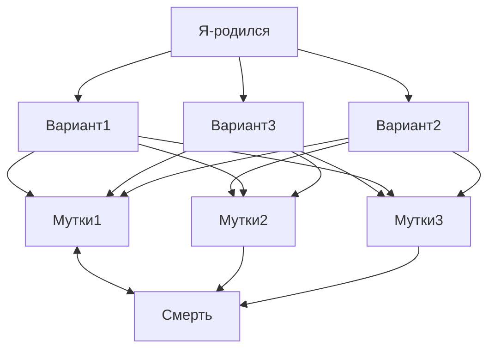

# Обо мне

  Родиля в Омске в 1971 году. Учился в школе №14. Закончил в 1993 году 
  Омский Политехнический Институт ОмПИ теперь он называется
  Омский Технический Университет ОмТУ. Факультет автоматизации 
  Специальность 2201 ЭВМ сисиемы комплексы и сети. ... Сейчас живу в Сочи

  <details>
  <summary> Тут живу </summary>

  ```geojson
{
  "type": "FeatureCollection",
  "features": [
    {
      "type": "Feature",
      "id": 1,
      "properties": {
        "ID": 0
      },
      "geometry": {
        "type": "Polygon",
        "coordinates": [
          [
              [39.5,43.6],
              [39.5,43.4],
              [40,43.4],
              [40,43.6],
              [39.5,43.6]
          ]
        ]
      }
    }
  ]
}
```
  
  </details> 
  
# Вот список моих интересов: 

## [Слепая печать на клавиатуре](typing.md)

## [NeoVim](neovim.md)

## GitHub

Тут я изучаю [MarkDown](https://docs.github.com/en/get-started/writing-on-github/getting-started-with-writing-and-formatting-on-github/basic-writing-and-formatting-syntax)

  <details>
  <summary> Mermaid диаграмы </summary>
Интересно что можно рисовать схемы:


  </details>    


## [Клавиатуры](keyboards.md)

## Языки программирования

  ### Java

  Видеоуроки:
  
  [Java с нуля / Ablazing](https://www.youtube.com/playlist?list=PLw265NhvhLXHptSyZ93dFd_7AoPnJTF1T)
  
  [Программирование на Java (весна 2022) Computer Science Center / Тахир Валеев](https://www.youtube.com/playlist?list=PLlb7e2G7aSpTCB2OxGlezpgOXwq4xer7Z)

  ### Swift

  [swift-book](https://docs.swift.org/swift-book/documentation/the-swift-programming-language/)

  [Youtube Свифт Марафон / Скутеренко](https://www.youtube.com/watch?v=YgEHfnD6_1c&list=PL6724Ll8v6UhOq6Otjw-rUPFsZVmoCLFm&index=3)

  [Основы Swift](https://youtube.com/playlist?list=PLUb9K99oQb2u1swlk6TTuV1vnMEG8ktfV&si=rUU5zRR_HHfa68sV)
  
  ### Python

<picture>
  <source media="(prefers-color-scheme: dark)" srcset="https://user-images.githubusercontent.com/25423296/163456776-7f95b81a-f1ed-45f7-b7ab-8fa810d529fa.png">
  <source media="(prefers-color-scheme: light)" srcset="https://user-images.githubusercontent.com/25423296/163456779-a8556205-d0a5-45e2-ac17-42d089e3c3f8.png">
  
</picture>
