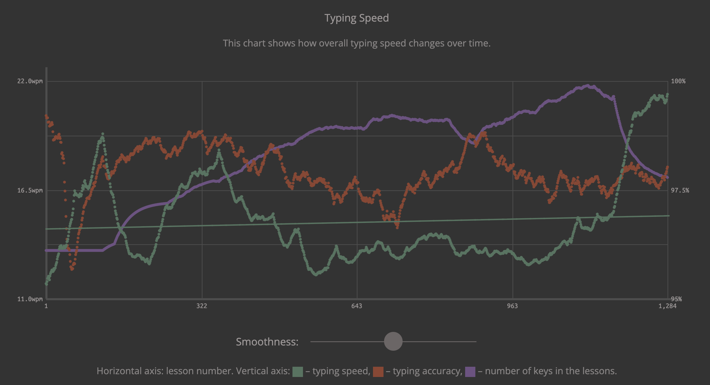
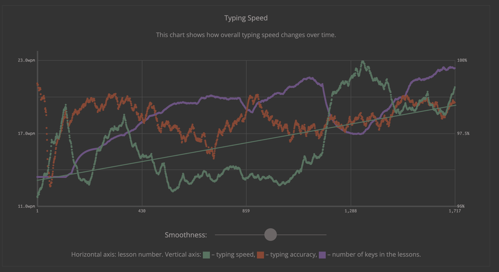
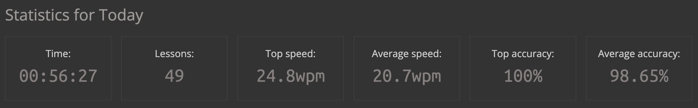
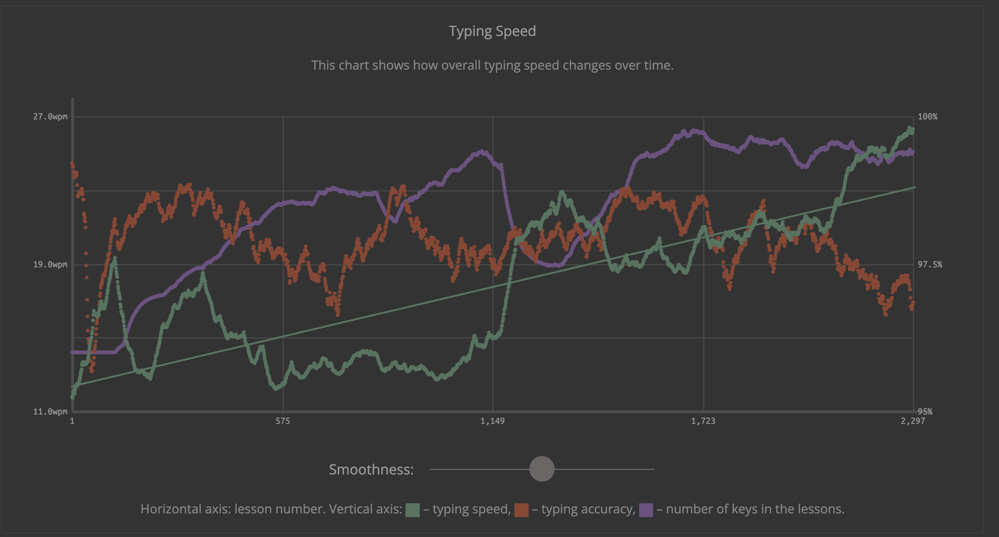
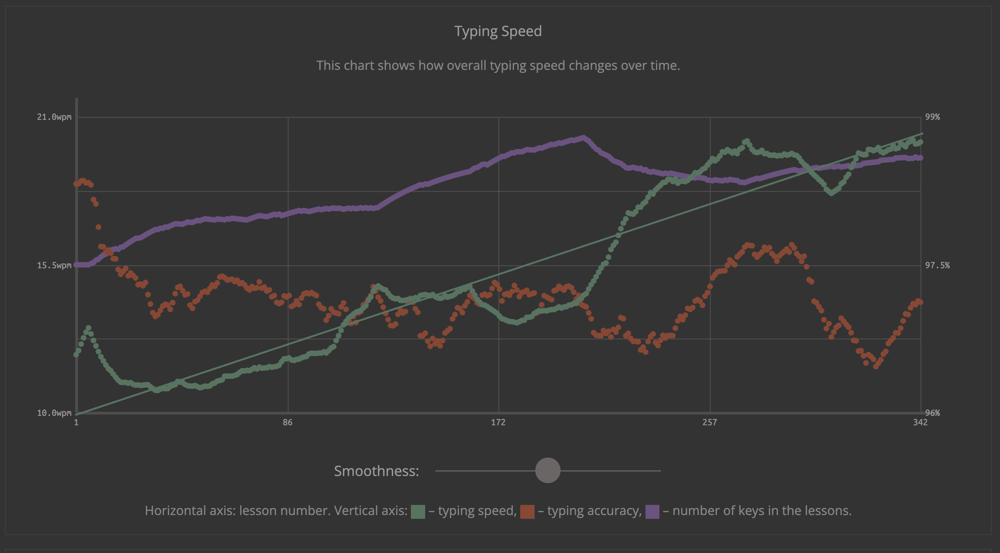
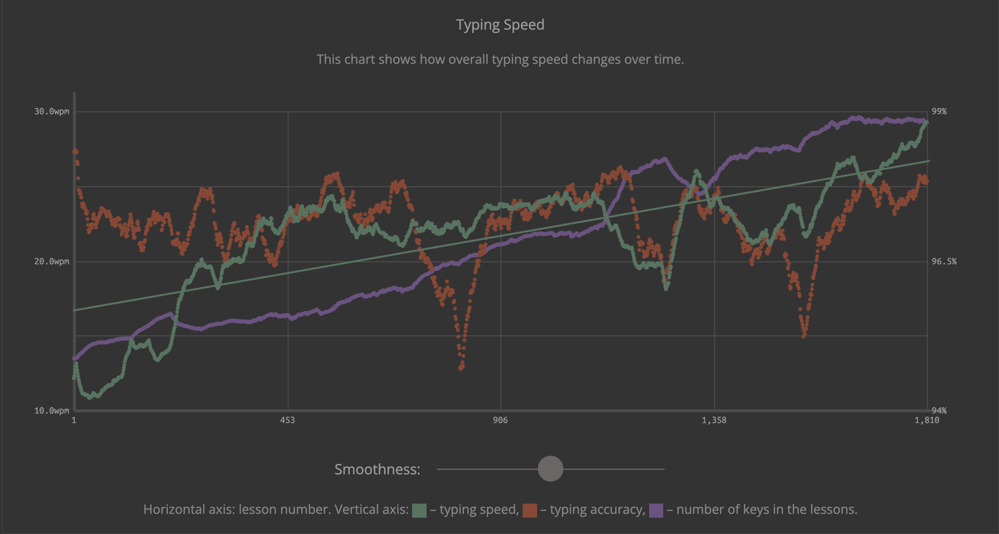
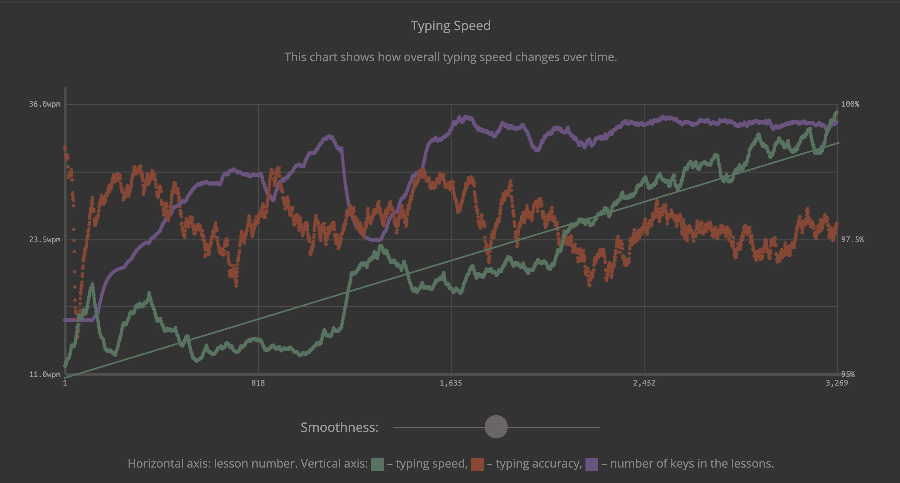

  # Хорошая соревновалка, но я до нее не дорос [MonkeyType](https://monkeytype.com/)

  # Хороший клавиатурный тренажер [Keybr](https://www.keybr.com/) на нем я сейчас тренируюсь
  
  | Месяц | Скорость wpm English | Скорость wpm Русский |
  | :---: |--------------|--------------|
  |  Март | 13wpm 15 Letters||
  | Апрель 1| 12wpm 17 Letters EH:03||
  | Апрель 2| 13wpm 17 Letters EH:03|
  | Апрель 9| 13wpm 16 Lettres 98 Accuracy| 10wpm 9 Букв 96 Accuracy|
  | Апрель 17| 14wpm 23 Lettres 96 Accuracy| 13wpm 11 Букв 96 Accuracy|
  | Апрель 19| dst 16 all 15wpm 12 Lettres 96 Accuracy| 14wpm 8 Букв 96 Accuracy|
  | Апрель 27| dst 16 20wpm 98 Accuracy| 
  | Апрель 28| | dst 16 19wpm 96 Accuracy|
  | Май 10| 20 wpm 97 Acc | 19wpm 97 Accuracy|
  | Май 17| 28 wpm 97 Acc | 24 wpm 97 Accuracy|
  | Июнь 09 | 30 wpm  | 25 wpm |
  | Июнь 12 | 33 wpm  | 30 wpm |
  | Июнь 21 | 38 wpm  | 35 wpm |
  | Июль 10 | 39 wpm  | 39 wpm |

  21-06-2026 обнаружил что не могу печатать в слепую на обычной не сплит клавиатуре что и следовало ожидать. 
  Стандатная маковская очень некомфортна плоской ощущается а обычная механика стагер неудобен т е мещение в клавишах. с 15-06-2026 перешел на [MonkeyType](https://monkeytype.com/) но продолжаю по 10 минут на keybr

  Вот публичный [линк](https://monkeytype.com/profile/EugeneK)
  
  
  
  
  English 2026-04-27
  
  
  English 2026-05-12
    Rus 2026-04-28
   

   
   

